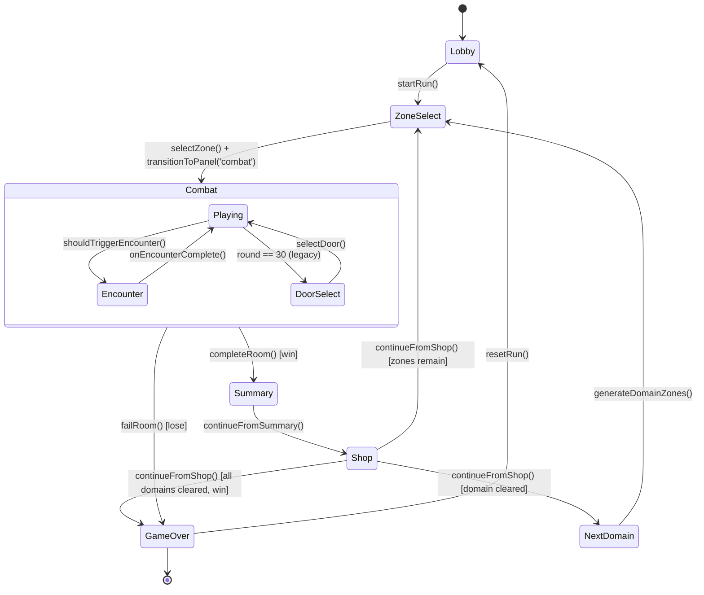

# State Machine

RunContext state machine diagram and transition documentation.

## State Diagram



## Core State Types

### CenterPanel
Controls what's visible in the main game area:

```typescript
type CenterPanel =
  | 'globe'    // 3D planet with zone markers
  | 'combat'   // Phaser game canvas
  | 'shop'     // Requisition interface
  | 'doors'    // Door selection (deprecated -> Narrative Fork)
  | 'summary'  // Post-combat score display
```

### GamePhase
Higher-level game state:

```typescript
type GamePhase =
  | 'event_select'    // Lobby, choosing to start
  | 'door_select'     // Picking zone (deprecated)
  | 'playing'         // In active gameplay
  | 'event_complete'  // Post-combat
  | 'shop'            // Shopping phase
  | 'encounter'       // NPC encounter
  | 'audit_warning'   // Error state
  | 'game_over'       // Run ended
```

### TransitionPhase
Animation state for panel swaps:

```typescript
type TransitionPhase =
  | 'idle'    // No transition
  | 'exit'    // Current panel exiting
  | 'wipe'    // TransitionWipe animating
  | 'enter'   // New panel entering
```

## RunState Interface

```typescript
interface RunState extends GameState {
  // Panel management
  centerPanel: CenterPanel;
  transitionPhase: TransitionPhase;
  pendingPanel: CenterPanel | null;

  // Domain/Zone tracking
  domainState: DomainState | null;
  selectedZone: ZoneMarker | null;

  // Progress tracking
  lastRoomScore: number;
  lastRoomGold: number;
  runEnded: boolean;

  // Dice hand (new for Play/Hold)
  diceHand?: DiceHand;
}
```

## State Transitions

### Transition Actions

| Action | From | To | Side Effects |
|--------|------|-----|--------------|
| `startRun()` | Lobby | ZoneSelect | Generate domain zones |
| `selectZone(zone)` | ZoneSelect | (preparing) | Set selectedZone |
| `transitionToPanel('combat')` | ZoneSelect | Combat | Start Phaser game |
| `completeRoom(score, stats)` | Combat | Summary | Record score, gold |
| `failRoom()` | Combat | GameOver | Set runEnded=true |
| `continueFromSummary()` | Summary | Shop | Load shop items |
| `continueFromShop()` | Shop | (varies) | Check progress |
| `resetRun()` | GameOver | Lobby | Clear run state |

### Panel Transition Flow

```
1. Call transitionToPanel(newPanel)
   |
   v
2. Set transitionPhase = 'exit'
   |
   v (200ms)
3. Set transitionPhase = 'wipe'
   Set pendingPanel = newPanel
   |
   v (400ms)
4. Set centerPanel = newPanel
   Set transitionPhase = 'enter'
   |
   v (200ms)
5. Set transitionPhase = 'idle'
   Set pendingPanel = null
```

## Sidebar State per Phase

| CenterPanel | Phase | Sidebar Content |
|-------------|-------|-----------------|
| globe | event_select | GameTab: New Run / Continue buttons |
| globe | playing | GameTabLaunch: Zone list + Launch button |
| combat | playing | GameTabPlaying: Score, throws, trades, combat feed |
| summary | event_complete | (hidden - summary in center) |
| shop | shop | (hidden - shop in center) |

**Sidebar Tabs (always available):**
- **Game** - Phase-specific content (see above)
- **Bag** - Inventory, loadout selection (lobby only)
- **Settings** - Sound, music, game speed, animations, Back to Menu

## Encounter Interrupts

Encounters can interrupt combat:

```typescript
function shouldTriggerEncounter(): boolean {
  const baseChance = 0.25;
  const heatBonus = heat * 0.05;
  return Math.random() < baseChance + heatBonus;
}
```

When triggered:
1. Pause combat
2. Show EncounterPanel (BottomSheet)
3. Player chooses: Accept / Decline / Provoke
4. Apply effects
5. Resume combat

## Auto-Save Points

State saved to localStorage at:
- Entering `phase: 'playing'`
- Entering `phase: 'shop'`

## Global Contexts

**RunContext** - Game state machine
- Manages centerPanel, phase, transitions
- Domain/zone tracking
- Score, gold, run stats

**SoundContext** - Audio system
- `playDiceRoll()`, `playImpact()`, `playVictory()`, `playDefeat()`
- `soundEnabled` toggle (persisted)

**GameSettingsContext** - Persistent settings
- `gameSpeed` (0.5x - 2x)
- `animationsEnabled`, `musicEnabled`
- `adjustDelay(ms)` - scales timing by game speed

## Files

- `/apps/web/src/contexts/RunContext.tsx` - State machine implementation
- `/apps/web/src/contexts/SoundContext.tsx` - Audio system
- `/apps/web/src/contexts/GameSettingsContext.tsx` - Persistent settings
- `/apps/web/src/screens/play/PlayHub.tsx` - Panel switching, progress bar
- `/apps/web/src/screens/play/components/PlaySidebar.tsx` - Sidebar tabs
- `/apps/web/src/screens/play/components/CombatTerminal.tsx` - Combat UI
- `/apps/web/src/types/zones.ts` - Zone/Domain types
